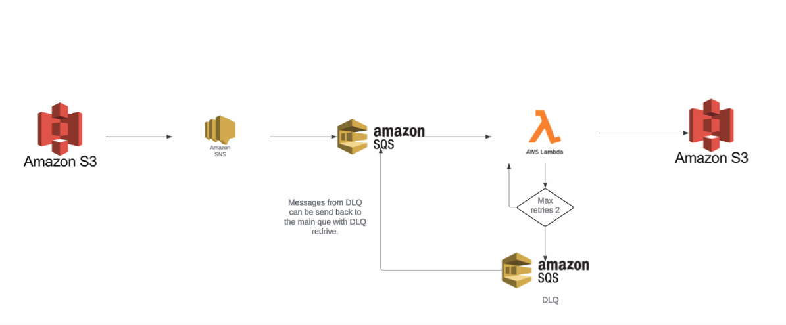

# cdk-etl-lambda

## Summary

This repo contains a basic etl-lambda code and instructions how to deploy it using AWS CDK. The other alternative for CDK would be for example using straight up CloudFormation, but for simple stacks I find using CDK to be more efficent and easy since you can for example use VSCode autocomplete and hints + CDK has some okayish defaults to parameters you do not define.

It should be kept in mind though, you are not deploying resources using CDK per se, but you are using CDK to create CloudFormation templates that are then deployed using CloudFormation and the resources can be found from under the CloudFormation stacks.

## Prerequisites

1. AWS Account
2. AWS CLI installed https://docs.aws.amazon.com/cli/latest/userguide/getting-started-install.html
3. Nodejs & NPM installed.
4. After those steps you can run ```npm install -g aws-cdk```

## Starting a project

1. Create an empty folder
2. Run ```cdk init sample-app --language python```. This will create a lot of boilerplate resources that are a good starting point to start working on the project.
3. A virtual environment is also created, activate it.
4. Run ```pip install -r requirements.txt```
5. If you are using VSCode and for some reason you get an import error on aws_cdk for example hit ```CTRL + SHIFT + P``` and select the Python interpreter for the current venv.

## Bootstrapping 

Before you can deploy AWS resources using CDK you need to bootstrap your AWS environment. The bootstrapping will prepare your AWS environment by provisioning AWS resources for the AWS CDK.

However, before you can carry out the bootsrapping you will need for example an AWS Admin user and access keys for it. This does not follow best practises but for simple personal projects I find it is the easiest and fastest way to get started.

### Creating an AdminUser

1. Navigate to the ```IAM``` in the AWS Console
2. Go to ```Users``` and ```Create user```
3. Give the User a meaningful name like "AdminUser", you do not need to give the user access to the AWS Management Console.
4. If you just started you most likely do not have a ```User group``` with the necessary permissions. Click the ```Create group``` button and attach the ```AdministratorAccess``` permission policy to the group and give the group a name. After that just click the ```Create user group``` button.
5. Then select the create group in the ```Set permissions``` step and hit next, review and click ````Create user```

Now you have a fully fledged AdminUser, by default the user has all permissions for all resources. Lastly you need to create access keys for the CLI.

1. Go to  ```Users``` and click the user that you created.
2. Go to ```Security Credentials```
3. Click ```Create Access Key```
4. Choose the CLI option and follow the wizard. Note: You can only see the secret key during the creation process, store it safely.

Then we need to set up the AWS CLI to use the newly created role.

1. Fire up CMD, shell etc.
2. Run ```aws configure```
3. Paste the key id
4. Paste the secret access key
5. Enter a region of your choosing.
6. Finally enter a default output format, if you want.

After that you can finally do the actual bootstrapping. Run ```cdk bootstrap``` and you will have a CloudFormation stack set up with resources needed for CDK.

## Architecture

