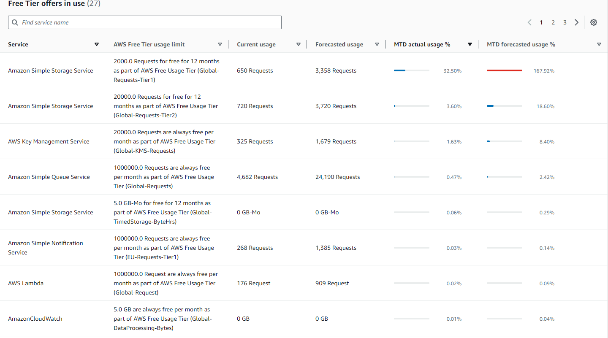

# cdk-etl-lambda

## Summary

This repo contains a basic etl-lambda code and instructions how to deploy it using AWS CDK. The other alternative for CDK would be for example using straight up CloudFormation, but for simple stacks I find using CDK to be more efficent and easy since you can for example use VSCode autocomplete and hints + CDK has some okayish defaults to parameters you do not define.

It should be kept in mind though, you are not deploying resources using CDK per se, but you are using CDK to create CloudFormation templates that are then deployed using CloudFormation and the resources can be found from under the CloudFormation stacks.

## Prerequisites

1. AWS Account
2. AWS CLI installed https://docs.aws.amazon.com/cli/latest/userguide/getting-started-install.html
3. Nodejs & NPM installed.
4. After those steps you can run ```npm install -g aws-cdk```

## Starting a project

1. Create an empty folder
2. Run ```cdk init sample-app --language python```. This will create a lot of boilerplate resources that are a good starting point to start working on the project.
3. A virtual environment is also created, activate it.
4. Run ```pip install -r requirements.txt```
5. If you are using VSCode and for some reason you get an import error on aws_cdk for example hit ```CTRL + SHIFT + P``` and select the Python interpreter for the current venv.

## Bootstrapping 

Before you can deploy AWS resources using CDK you need to bootstrap your AWS environment. The bootstrapping will prepare your AWS environment by provisioning AWS resources for the AWS CDK.

However, before you can carry out the bootsrapping you will need for example an AWS Admin user and access keys for it. This does not follow best practises but for simple personal projects I find it is the easiest and fastest way to get started.

### Creating an AdminUser

1. Navigate to the ```IAM``` in the AWS Console
2. Go to ```Users``` and ```Create user```
3. Give the User a meaningful name like "AdminUser", you do not need to give the user access to the AWS Management Console.
4. If you just started you most likely do not have a ```User group``` with the necessary permissions. Click the ```Create group``` button and attach the ```AdministratorAccess``` permission policy to the group and give the group a name. After that just click the ```Create user group``` button.
5. Then select the create group in the ```Set permissions``` step and hit next, review and click ```Create user```

Now you have a fully fledged AdminUser, by default the user has all permissions for all resources. Lastly you need to create access keys for the CLI.

1. Go to  ```Users``` and click the user that you created.
2. Go to ```Security Credentials```
3. Click ```Create Access Key```
4. Choose the CLI option and follow the wizard. Note: You can only see the secret key during the creation process, store it safely.

Then we need to set up the AWS CLI to use the newly created role.

1. Fire up CMD, shell etc.
2. Run ```aws configure```
3. Paste the key id
4. Paste the secret access key
5. Enter a region of your choosing.
6. Finally enter a default output format, if you want.

After that you can finally do the actual bootstrapping. Run ```cdk bootstrap``` and you will have a CloudFormation stack set up with resources needed for CDK.

## Architecture


### Resources created by the stack

1. 2 S3 buckets. One where the files are intended to land and one where the output files are stored.
2. SNS topic, which will receive messages for every ObjectCreated event from the source bucket
3. SQS queue which ingests the messages from the SNS topic.
4. DLQ where failed events are stored.
5. Lambda function which is triggered by the SQS.

### How to deploy

The stack requires one variable which in this case is called ```ENVIRONMENT```. This variable is intended to be use in the resource names. For example it is prefixed for the bucket names. 

It is usually a good idea to have somekind of prefix to your resource names, especially for S3 buckets, since they need to be unique globally. There also used to be a "situation" where AWS would charge the bucket owner for every unauthorized request. This means if someone knew your bucket name they could bombard it with requests and you would end up paying the bill. This has been addressed and more info can be found from here: https://aws.amazon.com/about-aws/whats-new/2024/05/amazon-s3-no-charge-http-error-codes/

But anyway, the stack can be deployed using the ```cdk deploy``` command with the parameters flag, here is an example:

```
cdk deploy --parameters ENVIRONMENT=myfunnyenvironment
```

### What costs can you expect from this?

If you are on your AWS freetier, it will basically cover everything, there is mainly one resource type that you might run out if you are testing the solution heavily.

The AWS freetier has a ton of free stuff but for some reason it only covers 2000 S3 tier 1 requests. The tier 1 requests are ```PUT```, ```COPY```, ```POST``` and ```LIST```. If you test the solution heavily you might run out of these. After you run out these it will cost you 0.005usd/1000 requests.

Other than that, the freetier should be sufficent, here is an example how much I ended up using from the freetier during this project by uploading 650 test files to the source bucket (all resources not included, only the few biggest ones):



NOTE: If you leave this stack running you will use up AWS resources atleast from the Lambda receiving ```Empty Receives```. This means that the Lambda function will go and ask the SQS queue if there is anything to handle, but the queue is empty hence the name.

Here is a good short post about the empty receives metric: https://repost.aws/knowledge-center/sqs-high-charges

## Cleaning up

You can simply delete the stack by running

```
cdk destroy
```
This will delete the created stack and all resources with it. The only exception is that if your buckets had files in them, they will give an error. If that happens just empty the buckets and run the command again.

CloudWatch logs will not be deleted, if you wish to delete the logs, navigate to CloudWatch and delete all Log groups.

Lastly you might have noticed that CDK is also a CloudFormation stack with a S3 bucket and other stuff. If you wish to delete this stack, delete stack from the CloudFormation UI in the Management Console. If you delete this stack, you need to bootstrap again if you wish to use cdk again.
The S3 bucket created by the stack will not be deleted, you can manually empty and delete it.

### Confirming the cleanup

Once all has been deleted, you can navigate to Tag Editor and search for all supported resource types in all AWS regions and check if there is any lingering resources that you wish to delete.

NOTE: There will be alot of default AWS resources like subnets, SecurityGroups etc. These are created automatically to a lot of AWS regions.